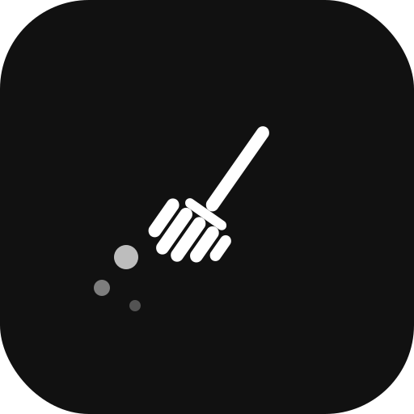

<div align="center">
  

  # AppSweeper

  **Smart App Closer for macOS**

  Close multiple apps at once — safely, without ever touching system processes.

  
  
  
  
</div>

---

## What is AppSweeper?

AppSweeper shows all your running user applications in a clean list. Pick the ones you want gone, hit the button — done. Finder, Dock, SystemUIServer and other essentials are permanently protected and will never appear in the list.

## Features

- **Live app list** — see every running foreground app at a glance
- **Safe by design** — 20+ system processes hardcoded as protected
- **Bulk close** — select individual apps or close everything non-essential in one click
- **Graceful quit** — uses AppleScript `quit`, identical to pressing Cmd+Q
- **Clean dark UI** — minimal, distraction-free interface

## Installation

### Download (recommended)

1. Grab `AppSweeper-1.0.0.dmg` from [**Releases**](https://github.com/yourusername/AppSweeper/releases)
2. Open the DMG and drag **AppSweeper** into your **Applications** folder
3. Launch from Spotlight or Launchpad

> **Security warning on first launch:** right-click the app → **Open**, or go to  
> **System Settings → Privacy & Security → Open Anyway**.  
> (This appears because the app is not yet notarized with Apple.)

> **Automation permission:** the first time AppSweeper tries to close an app, macOS  
> will ask for permission under **Privacy & Security → Automation**. Click **OK**.

### Build from source

**Requirements:** Python 3.10+, macOS 12 Monterey or later

```bash
git clone https://github.com/yourusername/AppSweeper.git
cd AppSweeper

# Optional but recommended — for a polished drag-to-install DMG
brew install create-dmg librsvg

# One command: installs deps, generates icon, builds .app and .dmg
chmod +x build.sh make_icon.sh
./build.sh
```

The finished `AppSweeper-1.0.0.dmg` will appear in the project root.

### Run directly (no build needed)

```bash
pip3 install -r requirements.txt   # only needed for building .app
python3 appsweeper.py
```

## Protected system processes

These are **always** protected — they will never appear in AppSweeper's list:

| Process | Role |
|---|---|
| Finder | File manager |
| Dock | App launcher & taskbar |
| SystemUIServer | Menu bar |
| WindowServer | Window compositor |
| loginwindow | Session management |
| NotificationCenter | Notifications |
| Spotlight | Search |
| Control Center | Quick settings |
| SecurityAgent | Authentication dialogs |
| … and more | Various system services |

## How it works

1. **List apps** — queries System Events via AppleScript for all visible (non-background) processes, then filters out the protected set.
2. **Quit apps** — sends `tell application "X" to quit` for each selected app. Apps get a chance to show a "save changes?" dialog before closing.

## Project structure

```
AppSweeper/
├── appsweeper.py      # Application (stdlib only — tkinter + subprocess)
├── setup.py           # py2app bundle configuration
├── build.sh           # One-command build: .app + .dmg
├── make_icon.sh       # SVG → .icns conversion
├── requirements.txt
├── .gitignore
└── assets/
    └── icon.svg       # Source logo (512×512, black & white)
```

## License

MIT © 2026
